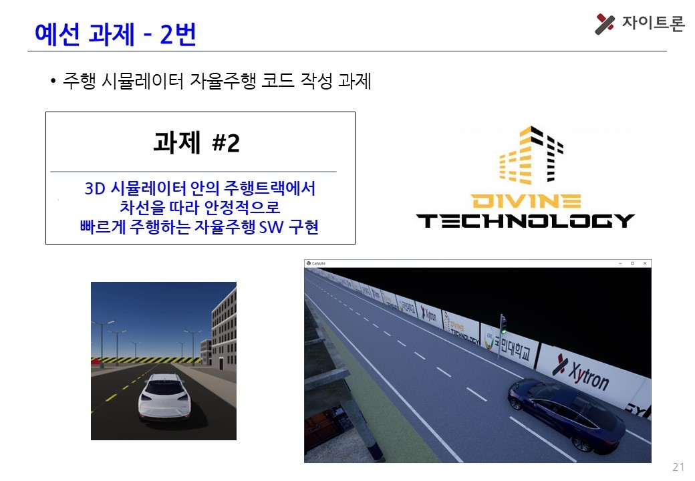
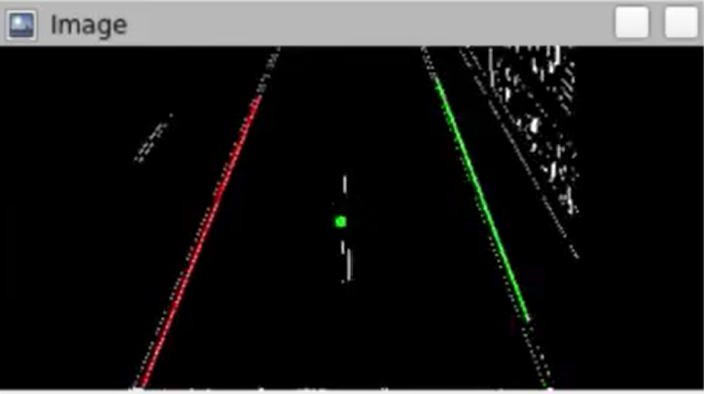
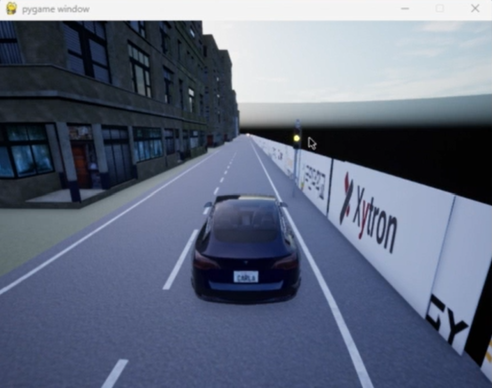
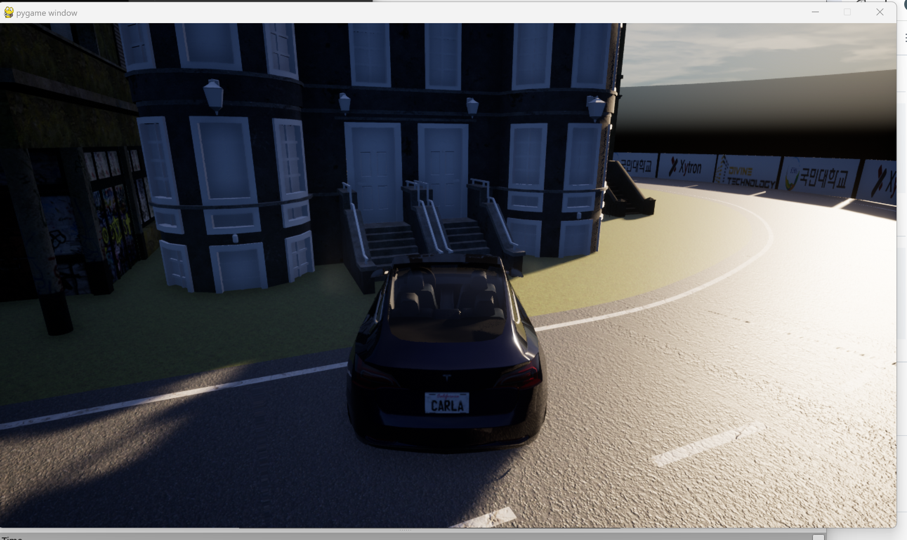
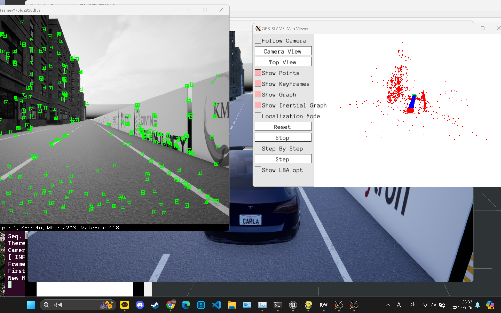
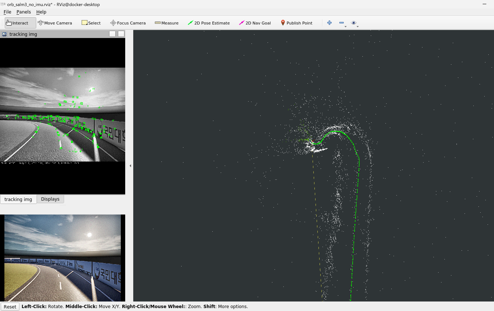
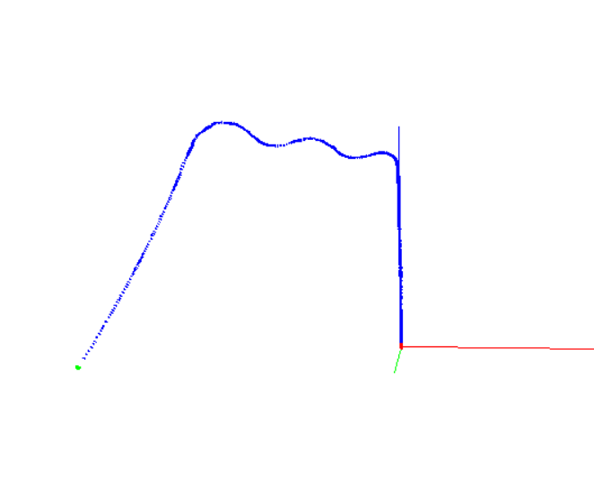

# 제7회 국민대학교 자율주행 경진대회 예선 과제2

## Task
- 3D 시뮬레이터 안의 주행트랙에서 차선을 따라 안정적으로 빠르게 주행하는 자율주행 SW 구현
- 시뮬레이터: CarlaUE4 
<br/>
 

***
## 실행 영상
<br/>

<br/>

[](https://youtu.be/7npOJLXqHKo)

***
## Method
**차선 인식 후 차량 제어**

- **차선 인식:**
    1. 차량 위쪽 카메라로 실시간 영상 받아옴
    2. 실시간 영상 전처리
    3. 직선 검출 알고리즘으로 차선 인식
    <br/>
- **차량 제어:**
    - 검출된 좌우측 차선의 중앙을 따라가도록 차량 제어
      
<br/>
<div style="display: flex; justify-content: space-around;">
  
  
</div>

<br/>
<br/>

<div style="display: flex; justify-content: space-around;">
  
  
</div>

<br/>

+) 추가 고려점: 
- 출발시 신호등 신호에 따라 출발
- 햇빛에 따라 주변 배경 밝기가 많이 달라짐 


***
## Project Tree (WSL2)

``` bash
.
└── src
    ├── CMakeLists.txt -> /opt/ros/noetic/share/catkin/cmake/toplevel.cmake
    ├── control
    │   ├── CMakeLists.txt
    │   ├── package.xml
    │   └── src
    │       ├── lane_keeping_control.py
    │       ├── pid_controller.py
    │       └── teleop_keyboard.py
    ├── integration
    │   ├── CMakeLists.txt
    │   ├── bag
    │   ├── config
    │   │   ├── integration.yaml
    │   │   ├── ov2slam.yaml
    │   │   └── sensors_info.yaml
    │   ├── launch
    │   │   ├── play.launch
    │   │   └── record.launch
    │   └── package.xml
    ├── perception
    │   ├── CMakeLists.txt
    │   ├── package.xml
    │   └── src
    │       ├── image_pre_processor.py
    │       ├── lane_detector.py
    │       ├── moving_average_filter.py
    │       ├── perception_utils.py
    │       ├── sig_sync.py
    │       └── start_signal.py
    ├── start.launch
    ├── test.launch
    └── visualization
        ├── CMakeLists.txt
        ├── package.xml
        ├── rviz
        │   └── start.rviz
        └── src
            └── show_image.py
```
***
## Installation (WSL2)

``` bash
$ cd ~/
$ git clone https://github.com/sangmyung-hwansoo-competitions/qualifying2.git
$ cd qualifying2
$ sudo ./build_container_ubuntu.sh
```

***
## Usage (WSL2)

``` bash
# CarlaUE4 디렉토리 속 퍼블릭키 입력 후 윈도우 상에서 CarlaUE4.exe 실행
$ sudo docker exec -it q2 bash
$ cd src
$ roslaunch test.launch
```

***
***
***
***
***
## 추가 실험
### ORB-SLAM
- ORB-SLAM으로 맵 구축 후 경로 생성을 하고자 하였음
- loop closing의 빈번한 발생과 햇빛에 영향에 따른 환경의 급격한 변화로 맵 구축이 쉽지 않았음
  - 추후 디버깅과 면밀한 코드 분석을 통해 성능 향상을 기대해볼 수 있을 것

<br/>

<div style="display: flex; justify-content: space-around;">
  
  
  
</div>
